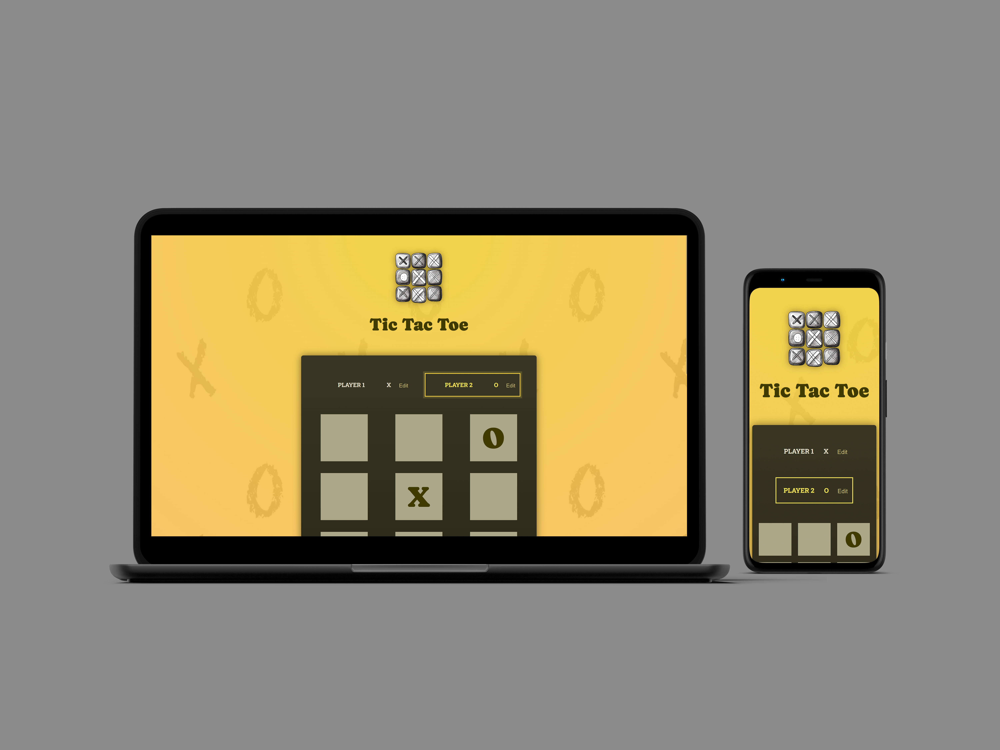

### **Tic Tac Toe Game**

## **Table of content:**

-   [Description](#description)
-   [Key Features](#key-features)
-   [Project Structure](#project-structure)
-   [Technologies Used](#technologies-used)
-   [How it works](#how-it-works)
-   [Conclusion](#conclusion)

**Live demo** [click here](https://tic-tac-toe-fun-game-app.netlify.app/)



---

### **Description:**

This is an interactive **Tic Tac Toe** game built with **React.js**, offering a fun and engaging way for two players to compete. The game allows players to input their names, providing a personalized experience. Each move is logged, offering a step-by-step history of the game for review.

---

### **Key Features:**

1. **Personalized Gameplay:**

    - Players can input their names, which are displayed throughout the game.

2. **Real-Time Logging:**

    - Each step is logged, showing the player’s move and the corresponding position on the board.

3. **Dynamic Game Logic:**

    - Includes logic for determining winners and managing draw conditions.
    - Displays the winner or a "Game Over" message in an intuitive interface.

4. **User-Friendly Interface:**
    - Simple and clean layout for a seamless gaming experience.

---

### **Project Structure:**

```
- index.html                  # Entry point of the application
- public
- README.md
- src
  ├── App.jsx                # Main application component
  ├── assets                 # Media assets for the project
  │   ├── desktop.png
  │   ├── localhost_5173_.png
  │   ├── overview.jpg
  │   ├── react.svg
  ├── components             # Modular components
  │   ├── GameBoard.jsx      # Renders the game board and manages gameplay logic
  │   ├── GameOver.jsx       # Displays the game over screen with results
  │   ├── Log.jsx            # Logs and displays each move
  │   ├── Player.jsx         # Manages player input and details
  ├── index.css              # Global styles
  ├── index.jsx              # Application entry point
  ├── winning-combinations.js # Defines winning combinations for the game
```

---

### **Technologies Used:**

-   **React.js**: Core library for creating the game logic and user interface.
-   **CSS**: For styling the game components and ensuring responsive design.

---

### **How It Works:**

1. Players enter their names before starting the game.
2. The game alternates turns between the two players.
3. Moves are logged in real-time, providing a history of the game.
4. When a player meets a winning condition, a "Game Over" screen displays the winner.
5. If all spaces are filled without a winner, the game declares a draw.

---

### **Conclusion:**

This **Tic Tac Toe** game combines fun gameplay with modern React.js development practices. Its clean interface and real-time logging make it a great project for showcasing skills in state management, modular design, and interactive UI development.
